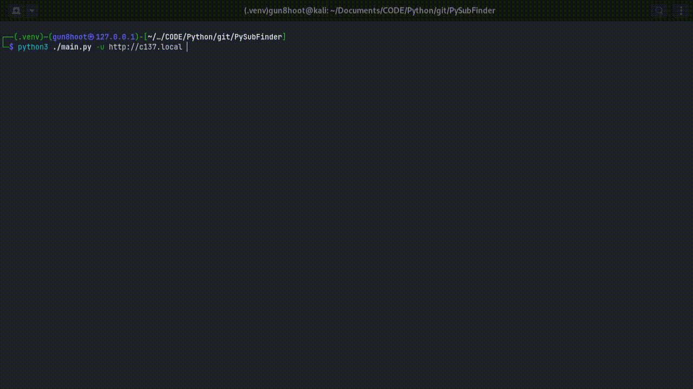

# PySubFinder
Subdomain finder write in python
### Install on Linux
---
- Clone the repository from Github
```shell
git clone https://github.com/Gun8hoot/PySubFinder.git
```
- Go to the project repository
```shell
cd ./PySubFinder
```
- **(optional)** : If you dont have a wordlist extract the subdomain_wl.tar file
```shell
tar -xvf ./subdomain_wl.tar
```
- **(optional)** :  Create a python virtual environement before installing every module
```shell
python3 -m venv .venv && source ./.venv/bin/activate
```
- Go to the project repository
```shell
pip install -r ./requirements.txt
```
### Usage
---
```shell
python3 ./main.py -u {URL} -f {WORDLIST_PATH}
```

***I dont know why admin was print twice***


---
> Write in: </br>
>[](https://skillcons.dev/)